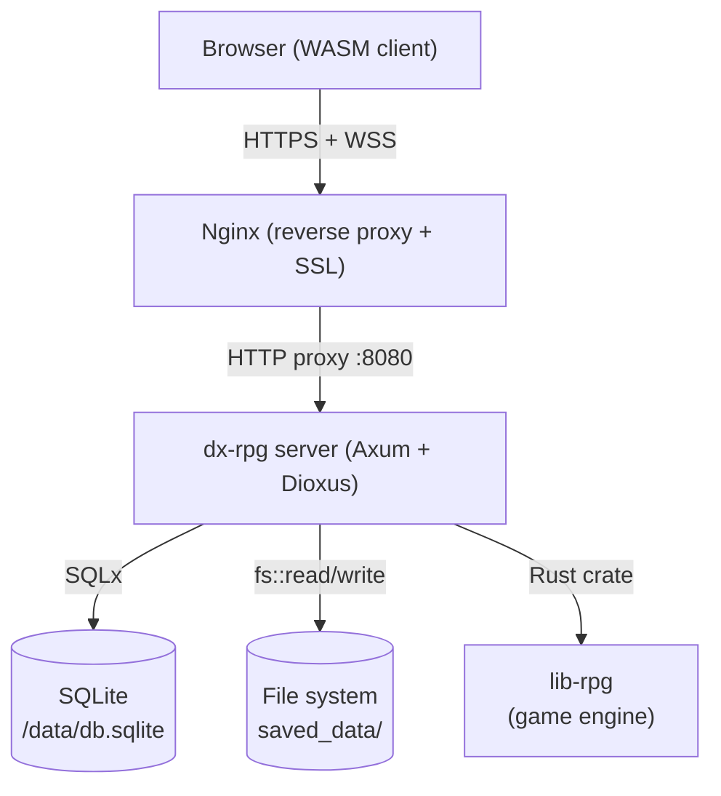
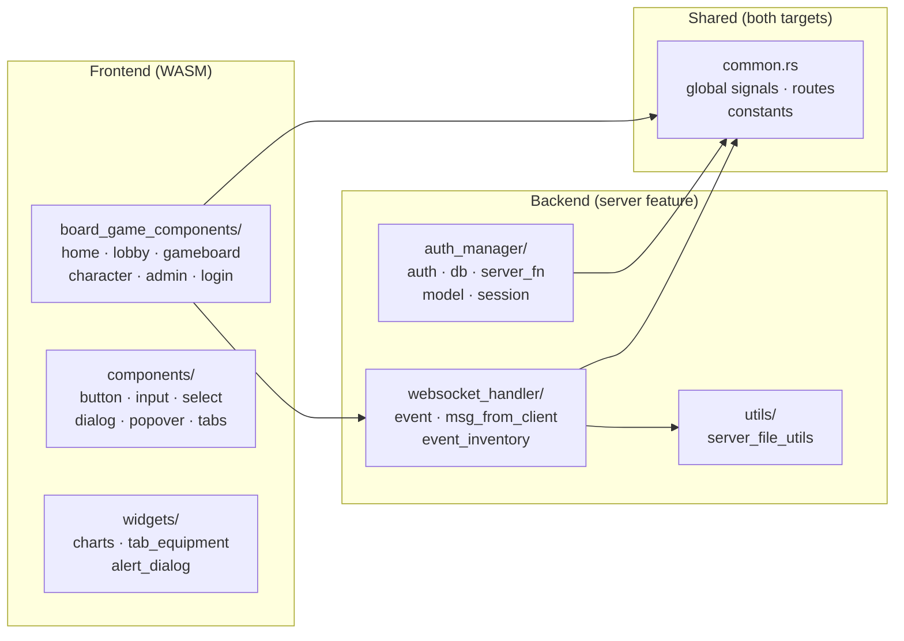
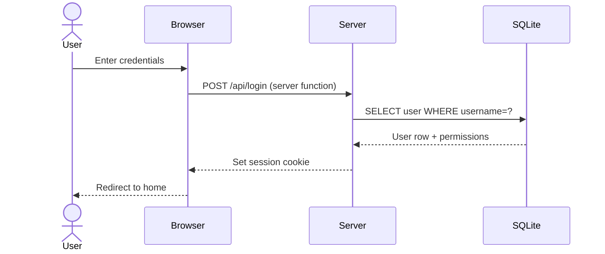
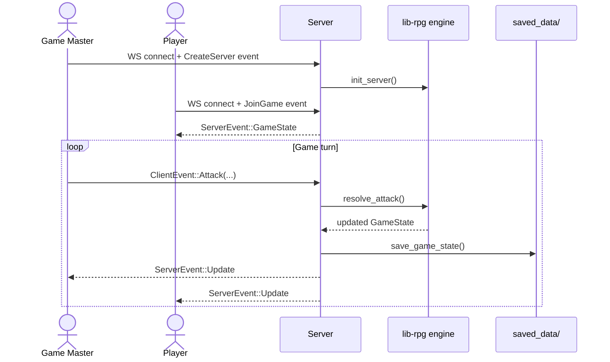
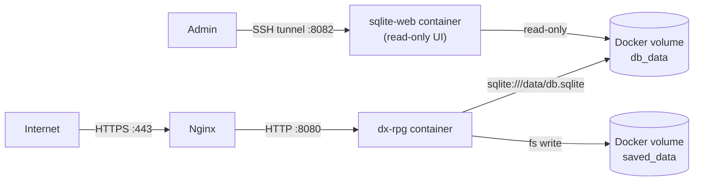
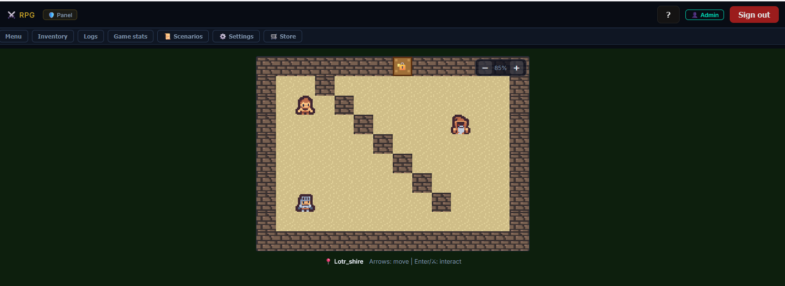
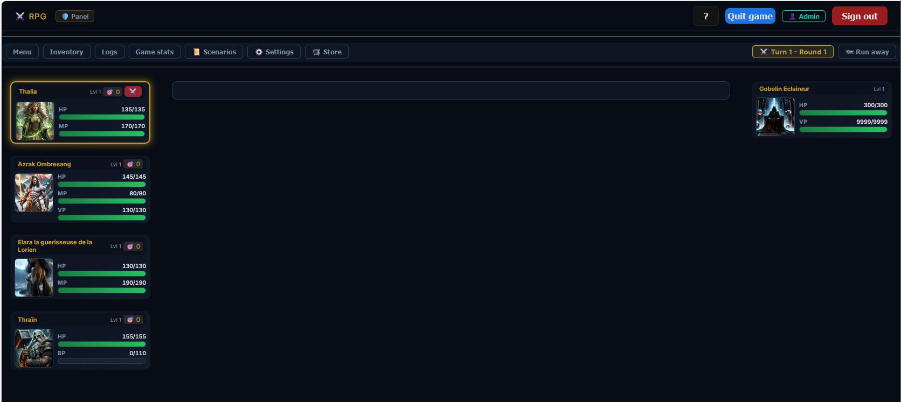
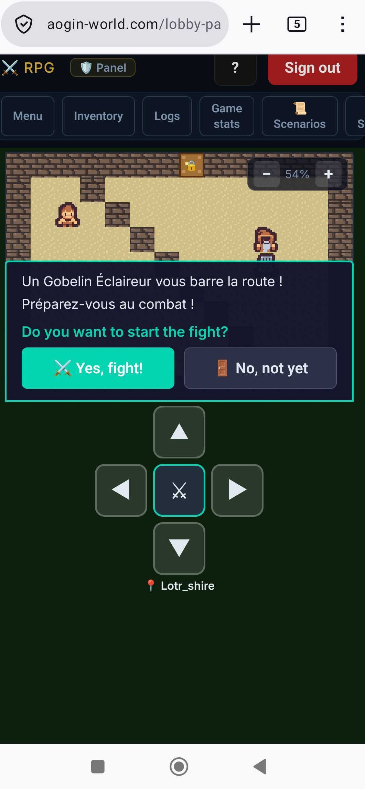

# Dx-rpg

A browser-based multiplayer RPG built with [Dioxus](https://dioxuslabs.com/) (Rust fullstack framework) using the [lib-rpg](https://github.com/r0nd0ud0u/lib-rpg) engine for game logic.

- **Frontend**: Dioxus (WebAssembly)
- **Backend**: Axum (HTTP + WebSocket server)
- **Database**: SQLite via SQLx
- **Auth**: Session-based with axum-session

---

## Table of Contents

- [Architecture](#architecture)
- [Project Structure](#project-structure)
- [Data Flow](#data-flow)
- [Development Setup](#development-setup)
- [Responsive Design](#responsive-design)
- [Internationalization (i18n)](#internationalization-i18n)
- [Deployment](#deployment)
- [Screenshots](#screenshots)

---

## Features

### Universes & Scenario Progression

The game ships with two universes, each with 10 progressive stages:

#### LOTR Universe (`offlines/scenarios/lotr/`)

| Stage | Name | Enemies |
|-------|------|---------|
| 1 | Goblin Patrol | Gobelin Eclaireur |
| 2 | Goblin Ambush | Gobelin Eclaireur + Angmar10PV |
| 3 | The Orc Pillager | Orc Pillard |
| 4 | Mixed Patrol | Orc Pillard + Gobelin Eclaireur |
| 5 | The Orc Champion | Champion Orc |
| 6 | Champion's Wrath | Champion Orc + Gobelin Eclaireur |
| 7 | Shadow of Mordor | Necromancien du Mordor |
| 8 | Ritual of Darkness | Necromancien du Mordor + Gobelin Eclaireur |
| 9 | The Faceless Rider | Nazgul |
| 10 | The Eye of Sauron | Sauron l'Oeil Flamboyant |

#### Pokémon Universe (`offlines/scenarios/pokemon/`)

| Stage | Name | Enemies |
|-------|------|---------|
| 1 | Rattata Patrol | Rattata |
| 2 | Double Strike | Rattata + Pidgey |
| 3 | Mankey's Fury | Mankey |
| 4 | Mountain Ambush | Mankey + Pidgey |
| 5 | Machoke the Colossus | Machoke |
| 6 | Gengar's Shadow | Gengar |
| 7 | Tower Ghosts | Haunter + Gengar |
| 8 | Dragonite Unleashed | Dragonite |
| 9 | Mewtwo Awakened | Mewtwo |
| 10 | Armored Mewtwo Ultimate | Mewtwo Armure |

**Pokémon Heroes** (selectable characters):

| Character | Class | Energy | Signature Moves |
|-----------|-------|--------|-----------------|
| Bulbasaur | Mage | Mana | Vine Whip, Leech Seed, Razor Leaf, Solar Beam |
| Charmander | Berserker | Berserk | Ember, Fire Spin, Flamethrower, Fire Blast |
| Squirtle | Warrior | Vigor | Water Gun, Withdraw, Surf, Ice Beam |

Each scenario is defined as a JSON file under `offlines/scenarios/`. Characters live in `offlines/characters/` and attacks in `offlines/attack/<character-name>/`.

### Save Slot System

Players are limited to a configurable number of save slots (default: 3). Configure via `.env`:

```env
MAX_SAVES=3
```

The "Create Server" page shows all save slots with:
- Empty slots: click to start a new game immediately
- Occupied slots: shows game name, current scenario, and last save date; click to select then "Overwrite & Play"

### Attack Tooltips with Description

Attacks can include two optional text fields in their JSON:

```json
{
  "Nom": "Razor Leaf",
  "Description": "Fires sharp leaves in a barrage — high damage with a short cooldown.",
  "DescriptionEffects": "Deals 60 magic damage to one enemy; 3-turn cooldown.",
  ...
}
```

When present, hovering over the attack button in the character sheet shows a tooltip with:
- `Description` — the flavour text, in italics
- `DescriptionEffects` — a structured **Effects** section summarising the mechanical effects (damage, buffs, cooldown…)

The tooltip is shown only while the **Attack Tooltips** setting is enabled (see Settings below).

> **Cooldown effects:** an attack is put on cooldown by a `CooldownTurnsNumber` effect. The number of turns the attack stays blocked is read from the effect's `Buffer.value` (and mirrored in `Value` / `Tours actifs`). These three must match — a `Buffer.value` of `0` means *no* cooldown, so the attack can be re-cast immediately.

### Scenarios Progress Sheet

During a game, click **📜 Scenarios** in the game toolbar to open a side sheet showing all scenarios and their progress state (Not Started / In Progress / ✅ Completed).

### Admin Panel

Enable the admin panel via `.env`:

```env
ADMIN_ENABLED=true
```

Navigate to `/admin` to access:
- **Users tab**: list all users with connection status and save count; delete users
- **Scenarios tab**: filter by universe, then list/add/edit/delete scenarios for that universe via an inline JSON editor
- **Characters tab**: filter by universe; list all hero characters with portrait, class, level, description, universe badge, and full stats table

### Game Mode: Single-player vs Multiplayer

When creating a server, choose between:
- **Multiplayer** (default): each connected player picks exactly one character; other characters appear as locked (🔒) on the selection screen
- **Single-player**: one player can pick multiple heroes; each extra hero is added with an `__sp{N}` key; the player controls all heroes in battle. Clicking a **selected** hero card in single-player mode deselects and removes that hero from the current game session.

The **Inventory sheet** adapts to the mode: in single-player it shows a tab per hero so you can inspect each character's stats & equipment; in multiplayer it shows only your own hero's data.

### Settings Panel (⚙️)

In the game toolbar, a **Settings** sheet lets each user toggle options that are persisted per-user in the DB:

| Setting | Key | Default | Description |
|---------|-----|---------|-------------|
| Attack Tooltips | `show_atk_tooltips` | on | Show attack description and effects on hover in the attack list |
| Boss Energy Bars | `show_boss_energy` | off | Show mana/vigor/berserk bars on boss panels |
| Hero Aggro | `show_hero_aggro` | off | Show aggro value on hero panel headers |
| Boss HP Bar | `show_boss_hp` | on | Show the HP bar on boss panels |
| Auto-save on Scenario | `auto_save_on_scenario` | on | Automatically save the game at the start of each new scenario |

Each setting is stored as an independent context in Dioxus using a distinct newtype wrapper (`CtxShowBossHp`, `CtxShowBossEnergy`, etc.) to prevent context-key collisions that would otherwise occur since all `Signal<bool>` share the same `TypeId`.

### Store (🛒)

The store is available **between scenarios** (end-of-scenario screen). Click the **🛒 Shop** button in the action bar that appears alongside "Load Next Scenario". The shop panel slides in from the right.

During active combat the Store button in the toolbar is locked (🛒 Shop 🔒) — purchasing is only possible while reviewing scenario results.

**Currency — Gold**

Gold is earned as loot at the end of each scenario. The current balance is displayed in the store header (`💰 N gold`) and in the Scenarios sheet.

**Buying items**

The store catalog is split into two sub-tabs:

| Sub-tab | Contents |
|---------|----------|
| Equipment | All generic equipment pieces (weapons, armour, rings, etc.) loaded from `offlines/equipment/`. Tattoos are excluded — they are character-specific and cannot be traded. |
| Consumables | Potions and buffs (see table below). |

Each item card shows:
- Name and rank badge (Common / Intermediate / Advanced)
- Category (for equipment) or description (for consumables)
- Key stat bonuses in a compact grid (equipment only)
- Price in gold

The **Buy** button is disabled when the character cannot afford the item. When one or more copies already sit in the bag the button label includes `(×N in bag)`.

Bought items land in the **bag** (unequipped). To use equipment you must equip it from the **Inventory** sheet.

**Consumable catalog**

| Item | Price |
|------|-------|
| potion | 50 gold |
| super potion | 150 gold |
| hyper potion | 300 gold |
| potion of resurrection | 500 gold |
| mana potion | 80 gold |
| vigor potion | 80 gold |
| berserk potion | 80 gold |

Consumables have no purchase limit — you can buy as many as you can afford. Like equipment, consumable names are bilingual (`name`/`name_fr` on `Consumable`, `name_en`/`name_fr` in the shop catalog) so a potion displays correctly whether it was bought or looted, regardless of the active UI language.

**Equipment price tiers**

| Tier | Condition | Price |
|------|-----------|-------|
| Starter | `unique_name` starts with `"starting"` | 100 gold |
| Advanced | `unique_name` starts with `"medium"` | 300 gold |
| Standard | all other equipment | 200 gold |

**Selling items (Bag tab)**

Switch to the **Bag** tab to see everything you own but have not yet equipped. Each item has a **Sell** button showing the refund amount (50 % of the catalog buy price). Equipped items cannot be sold — unequip them first from the Inventory sheet.

### Damage Formula & Armor

Combat damage is computed by `lib-rpg` using:

```
raw_damage  = atk_value − (launcher_power / nb_turns)
effective   = round(raw_damage × 100 / (100 + target_armor))
```

The armor constant `100` means that:
- A character with **100 armor** takes **half** of the raw hit
- Hero armor (0–90 range) gives **16–47% damage reduction** — meaningful enough that armor upgrades and debuffs visibly affect outcomes
- Boss armor is tuned in the same scale (e.g. Angmar 80, Nazgul 50) to preserve boss durability relative to hero attacks

The combat log shows the actual HP change and, when the armor cap reduces the raw hit, a `(raw: N)` reminder:
```
Last attack: Charge
Squirtle → -43 HP (raw: -75)
```

Non-HP effects display descriptive text:
```
Thraïn_#1 → 40 HP (raw: 140)
Thraïn_#1 → debuff removed
Thraïn_#1 → HP effects reset
Cooldown on Thalia_#1: 5 turns
```

`GameAtkEffect::log_text()` in lib-rpg centralises this rendering logic and returns `None` for
no-op effects (e.g. `RemoveOneDebuf` when there is no debuff to remove) so they are silently
skipped rather than showing a confusing `→ 0` line.

### Overworld Exploration

Between (or during) fights the owner can click **🗺 Overworld** / **🗺 Explore Overworld** to switch to a top-down map view.

**Controls**

| Key / Control | Action |
|---------------|--------|
| Arrow keys | Move hero |
| Enter / Space | Interact with adjacent NPC |
| Virtual D-pad (touch) | Move + interact on mobile / tablet |
| ⚔️ Back to Fight | Return to the active fight |
| +/− zoom buttons | Zoom the map in/out (persisted per user — the same zoom level is restored the next time you enter the overworld) |

**Auto-save:** finishing a scenario that was launched from the overworld and returning via **🗺 Explore Overworld** automatically saves the game. Reloading that save resumes directly in the overworld instead of at the last manual save.

**Map tiles — emoji legend**

| Tile | Emoji | Description |
|------|-------|-------------|
| Floor | *(empty)* | Walkable path |
| Wall | 🧱 | Impassable |
| Grass | *(green)* | Walkable; may trigger a random encounter |
| Water | 💧 | Impassable |
| Door | 🚪 | Transitions to another map |

**Map files** live in `offlines/maps/<map_id>.json`.  Each map specifies:
- `tiles` — 2-D grid of `"floor"`, `"wall"`, `"grass"`, `"water"`, or a door object `{"door":{"target_map":"…","spawn":{…}}}`
- `npcs` — list of NPCs with `id`, `x`, `y`, `dialog`, and optional `fight_scenario_id` (triggers a fight on interact)
- `spawn` — default spawn position for heroes entering this map
- `encounters` — list of scenario IDs that can be randomly triggered by walking on grass tiles

**Available maps**

#### Pokémon maps

| Map | Notes |
|-----|-------|
| `pallet_town` | Starting hub; door to Route 1; Professor Oak NPC; grass encounters |
| `route_1` | Tall grass with random Rattata / Double Attaque encounters; door back to Pallet Town |

#### LOTR maps (linear chain — each map connects north → south)

| Map | Friendly NPC | Enemy NPC | Fight scenario | Connects to |
|-----|-------------|-----------|----------------|-------------|
| `lotr_shire` | Gandalf | Gobelin Eclaireur | *Patrouille Gobeline* (stage 1) | → Forêt Ancienne (north, locked until boss beaten) |
| `lotr_foret_ancienne` | Sylvain le Forestier | Gobelin Embuscade | *Embuscade Gobeline* (stage 2) | ↑ Col Brumeux · ↓ La Comté |
| `lotr_col_brumeux` | Nain Errant | Orc Pillard | *Le Pillard Orc* (stage 3) | ↑ Plaines de Rohan · ↓ Forêt Ancienne |
| `lotr_plaines_rohan` | Cavalier Rohan | Patrouille Mixte | *Patrouille Mixte* (stage 4) | ↑ Isengard · ↓ Col Brumeux |
| `lotr_isengard` | Saruman Captif | Champion Orc | *Le Champion des Orcs* (stage 5) | ↑ Moria · ↓ Plaines de Rohan |
| `lotr_moria` | Gimli | Champion Orc 2 | *Colère du Champion* (stage 6) | ↑ Forêt du Mordor · ↓ Isengard |
| `lotr_foret_mordor` | Aragorn | Nécromancien | *L'Ombre du Mordor* (stage 7) | ↑ Gorge du Mordor · ↓ Moria |
| `lotr_gorge_mordor` | Legolas | Nécromancien 2 | *Rituel des Ténèbres* (stage 8) | ↑ Plaine du Désespoir · ↓ Forêt du Mordor |
| `lotr_plaine_desespoir` | Frodon | Nazgul | *Le Cavalier Sans Visage* (stage 9) | ↑ Mont Doom · ↓ Gorge du Mordor |
| `lotr_mont_doom` | Gandalf Blanc | Sauron | *L'Œil de Sauron* (stage 10) | ↓ Plaine du Désespoir |

The north door of each LOTR map is **locked** (`locked_doors` in the JSON) until the enemy NPC on that map is defeated.

**Random encounters** are driven by the `encounters` list in the map JSON — the field accepts any scenario ID, keeping the mechanism universe-agnostic. The encounter probability per grass step is 50 %.

**NPC-triggered fights** are configured via `fight_scenario_id` in the NPC definition:
```json
{"id":"goblin","x":3,"y":4,"dialog":[],"fight_scenario_id":"Patrouille Gobeline"}
```
If the NPC has a non-empty `dialog` array, the dialog is shown first; pressing interact a second time (or pressing the center D-pad button) starts the fight. With an empty `dialog` the fight starts on the first interact.

**Boss NPC lifecycle**

Once a boss-fight scenario (linked via `fight_scenario_id`) is won, the NPC is marked `defeated` in the overworld state and removed from the map. This is independent of random grass encounters, which can re-trigger at any time.

**Toolbar in overworld mode**

All standard toolbar sheets (Save, Inventory, Stats, Scenarios, Logs, Store, Settings) are available while exploring the overworld via the toolbar above the map.

**Position persistence across fights**

When a fight is triggered from the overworld (either via NPC interact or a random grass encounter) and later won, clicking **🗺 Explore Overworld** returns the party to the same map and position they were at before the fight — no reset to the map spawn point.

**Save / Load in overworld mode**

If the game is saved while `game_phase == Overworld`, loading that save re-opens the game directly in overworld mode (same map, same party position, same NPC states). The lobby "Continue" button replaces "Start Game" for these saves.

**Mobile / tablet layout**

The overworld map is wrapped in a scrollable container so it never overflows on narrow screens. A virtual D-pad grid (3 × 3, 56 px buttons) is shown below the map on touch devices and hidden on mouse/pointer devices via `@media (hover: hover) and (pointer: fine)`. The standard keyboard controls (`ArrowUp/Down/Left/Right`, `Enter`, `Space`) remain available on desktop.

### Action Banner

The gameboard shows a contextual banner above the combat log for every action:

- **Attack** — `⚔️ {launcher} attacks!` for both heroes and bosses. The banner uses `boss-atk-banner` CSS class for boss actions and `hero-atk-banner` for hero actions.
- **Consumable use** — the potion log message (e.g. `Thraïn used a potion`) displayed with the `action-banner` CSS class. The consumable header is cleared on the next attack so the banner switches back to the attack message.

`CoreGameData.last_action_header` carries the consumable display text from the server to clients. It is set in the potion WebSocket handlers and cleared whenever a real attack is processed.

### Game Stats Sheet (improved)

The 📊 Stats sheet now shows:
- KPI grid: Turn, Round, Kill count (correctly accumulates across scenarios)
- Active player indicator
- Scenario progress bar (scenarios completed / total)
- Current scenario name, level, universe
- HP bars for all active heroes
- Favourite attack card spanning full width to avoid truncation

### Talent Trees

Every hero earns skill points as they level up: **+1 per level**, plus a **+1 bonus every 5th level**. Points are spent in the 🌳 Talents sheet (opened next to Inventory/Stats) on a per-hero talent tree with three thematic paths:

- **5 tiers per path**, costing `1, 1, 2, 3, 4` skill points — cheap to start, expensive to finish, so a hero can fully max one path or spread points across two, but never max all three.
- **Capstones** (tier 5) are **mutually exclusive across a hero's 3 paths** — unlocking one path's capstone locks out the other two until you respec.
- **Respec is free and unlimited** — a Respec button in the sheet refunds every spent point instantly so players can experiment with builds.
- **Unspent-points notification**: the 🌳 Talents button shows a badge whenever a hero has skill points the player hasn't seen yet (granted on level-up). Opening the Talents tab for that hero dismisses the badge immediately, even if points are still unspent — it mirrors the Inventory tab's new-equipment badge (`TalentBoard::has_unseen_points`/`mark_points_seen`, `Inventory::has_unseen_equipment`/`mark_equipment_category_seen`).

Talent trees are defined as JSON under `offlines/talents/<universe>/<character-name>.json` (same convention as `offlines/characters/`), one file per hero, each listing its 3 paths and their tiered nodes (id, cost, prerequisites, bilingual name/description, and effects).

Beyond plain stat/percent boosts, higher tiers lean on more distinctive combat mechanics for real build variety: guaranteed critical strikes or dodges/blocks every N turns (`StreakBreakerCrit`/`StreakBreakerDodge`), a flat crit-damage multiplier bump (`DamageCritCapped`), doubled healing (`MultiValue`), converting damage dealt into healing for your neediest ally (`IsDamageTxHealNeedyAlly`), and turning excess healing received into a burst boost to a chosen stat (`OverHealBoostStat`). Each hero's three capstones are deliberately distinct mechanics, not just bigger versions of the same number.

Mechanically, a talent's effect is either a permanent stat modifier (`ChangeMaxStat`/`ChangeCurrentStat`, e.g. `+15% Max HP`) applied through the same accumulator equipment uses, or a passive combat modifier read live by the existing buff/debuff resolution (`character_rounds_info.all_buffers`) — unlocking/respeccing a talent doesn't require any new combat-engine code, just adding/removing a `Buffer` entry on the character. Effects are routed by `kind`, not by whether their `stats_name` happens to match a real stat — some kinds (like `OverHealBoostStat`) legitimately name a stat for their own purposes without being a stat accumulator themselves.

### Load Game page

The Load Game page now shows save-slot style cards identical to the Create Server page, with load and delete actions inline.

---

## Configuration (`.env`)

| Variable | Default | Description |
|----------|---------|-------------|
| `IP` | `0.0.0.0` | Bind address |
| `PORT` | `8080` | HTTP port |
| `DATABASE_URL` | `sqlite:db.sqlite` | SQLite connection string |
| `USE_PASSWORD` | `false` | Require password on login |
| `MAX_SAVES` | `3` | Max save slots per user |
| `ADMIN_ENABLED` | `false` | Enable `/admin` panel |
| `SERVER_URL` | `http://127.0.0.1:8080` | Client-only, native builds (desktop/mobile): remote multiplayer server to connect to. Ignored by the web client, which infers it from same-origin, and by the server itself. |
| `INSECURE_ACCEPT_INVALID_CERTS` | `false` | Client-only, native builds: when `true`, disables TLS certificate validation (for a self-signed `SERVER_URL`). Insecure — see [Desktop & Mobile Clients](#desktop--mobile-clients). |

---

## Architecture

### High-level overview



### Module map



---

## Project Structure

```
dx-rpg/
├── src/
│   ├── main.rs                   # Entry point — client launch + server setup (Axum)
│   ├── lib.rs                    # Module declarations
│   ├── common.rs                 # Shared globals (signals, routes, constants)
│   ├── auth_manager/             # User authentication & session management (server only)
│   │   ├── db.rs                 # SQLite pool init, table creation, seed data
│   │   ├── auth.rs               # Axum auth layer
│   │   ├── server_fn.rs          # Dioxus server functions for login/logout
│   │   └── model.rs              # User model
│   ├── board_game_components/    # Page-level Dioxus components
│   │   ├── home_page.rs          # Landing / dashboard
│   │   ├── login_page.rs         # Login form
│   │   ├── lobby_page.rs         # Pre-game lobby
│   │   ├── gameboard.rs          # Main game UI
│   │   ├── character_page.rs     # Character sheet
│   │   ├── admin_page.rs         # Admin panel
│   │   └── ...
│   ├── components/               # Reusable UI primitives (button, input, select…)
│   ├── websocket_handler/        # Real-time game event bus (client ↔ server)
│   │   ├── event.rs              # ClientEvent / ServerEvent enums + handlers
│   │   ├── msg_from_client.rs    # Incoming message parsing
│   │   └── event_inventory.rs    # Per-session event queue
│   ├── utils/
│   │   └── server_file_utils.rs  # Save / load game state to/from disk
│   └── widgets/                  # Composite UI widgets (charts, equipment tab…)
├── offlines/                     # Static game data (characters, scenarios, attacks)
│   ├── characters/               # JSON character definitions — organized by universe
│   │   ├── lotr/                 # LOTR hero & boss characters
│   │   └── pokemon/              # Pokémon hero & boss characters
│   ├── scenarios/                # JSON scenario definitions — organized by universe
│   │   ├── lotr/                 # LOTR stages (stage_1.json … stage_10.json)
│   │   └── pokemon/              # Pokémon stages (stage_1.json … stage_10.json)
│   └── attack/                   # JSON attack/skill definitions
├── assets/                       # CSS and static assets
├── docs/                         # Deployment documentation
├── scripts/                      # Build & Docker helper scripts
├── Dockerfile                    # Multi-stage Docker build
├── deploy/                       # Docker Compose stack & Nginx configs
│   └── docker-compose.yml        # Production stack (app + SQLite web UI)
└── Cargo.toml
```

---

## Data Flow

### Authentication flow



### Game session flow (WebSocket)



### Docker / production deployment flow



---

## Development Setup

### Prerequisites

- Rust stable toolchain
- Dioxus CLI (`cargo binstall dioxus-cli@0.7.9 --force`)
- SSH access to the lib-rpg private dependency (add to `~/.cargo/config.toml`):

```toml
[net]
git-fetch-with-cli = true

[target.wasm32-unknown-unknown]
rustflags = ['--cfg', 'getrandom_backend="wasm_js"']
```

### Run locally

```bash
dx serve --platform web
# Open http://localhost:8080
```

### Desktop & Mobile Clients

Besides the web/fullstack build (which bundles the Axum server together with the
WASM client, see [Deployment](#deployment)), the app can also be built as a
**native client** that connects to a remote dx-rpg server instead of hosting one
itself — useful for players who want a desktop app or an Android app talking to
someone else's server.

Native clients compile with the `desktop` or `mobile` Cargo feature instead of the
default `server` feature, and read the server address from the `SERVER_URL`
environment variable at startup (defaults to `http://127.0.0.1:8080` if unset):

```bash
# Desktop, local dev
dx serve --platform desktop --no-default-features --features desktop

# Point at a remote server
SERVER_URL=https://your-server.example.com dx serve --platform desktop --no-default-features --features desktop
```

Release bundles are produced with the same scripts the CI release workflow uses:

```bash
./scripts/bundle_desktop.sh                       # -> bundle-desktop/  (Windows/Linux/macOS native app)
./scripts/bundle_mobile.sh aarch64-linux-android   # -> bundle-android/  (arm64-v8a .apk — real phones)
```

`bundle_mobile.sh`'s target triple argument matters: without it, `dx bundle` picks its own
default ABI, which may not match your phone's — the app then simply fails to install
("app not compatible with this device"). Requires the Android SDK/NDK and the matching
`rustup target add <triple>`. arm64-v8a (`aarch64-linux-android`) covers essentially every
real Android phone since ~2019; `x86_64-linux-android` also works, for emulator testing.
32-bit targets (`armv7-linux-androideabi`, older devices) don't build — `dioxus`'s
`manganis` crate hard-requires a 64-bit Android target as of dioxus 0.7.9.

Unlike the web bundle, these client-only bundles don't ship `offlines/`, `db.sqlite`,
or a `.env` file — that data belongs to the server, not the client. Set `SERVER_URL`
in the environment before launching the built client.

**Self-signed / untrusted TLS certificate:** if `SERVER_URL` is `https://` and the
server's certificate isn't signed by a trusted CA (e.g. a self-signed cert on a
home-lab or dev deployment with no domain for Let's Encrypt), the native client's
HTTP/WebSocket stack rejects the connection outright — there's no browser-style
"proceed anyway" click-through. The proper fix is a real trusted certificate (see
[Deploying on a VPS](docs/deploy-vps.md), which covers the Let's Encrypt + domain
flow). As a stopgap for testing against a self-signed server you control, set
`INSECURE_ACCEPT_INVALID_CERTS=true` to disable certificate validation for that
client. This is insecure — anyone on the network path can impersonate the server —
so only use it against a server and network you trust, never for a real deployment.

---

## Responsive Design

The UI is designed to work on desktop, tablet, and mobile devices.
All responsive rules live in `assets/main.css` as two `max-width` media-query layers
stacked on top of the existing desktop-first styles.

### Strategy

| Breakpoint | Target | Key changes |
|------------|--------|-------------|
| ≥ 769 px (default) | Desktop | Full 3-column game board, fixed navbar, all sidebars visible |
| ≤ 768 px | Tablet / landscape phone | Game board collapses to single column (heroes → log → bosses stacked), reduced padding & font sizes, toolbar wraps, username badge hidden |
| ≤ 480 px | Portrait phone | Action grid forces 2 columns, save-slot cards go 1-column, mode-toggle and action buttons stack vertically, character portrait shrinks to 56 px |

### What is already responsive (no media queries needed)

- Most card grids use `auto-fill` / `auto-fit` and reflow naturally.
- Admin tables scroll horizontally via `overflow-x: auto` on their container.
- The footer and lobby info bar use `flex-wrap: wrap`.
- The viewport meta tag (`width=device-width, initial-scale=1`) is present in `index.html`.

### Touch-friendliness notes

- All interactive buttons are `≥ 44 px` tall in their default (desktop) state.
- Attack target buttons use absolute positioning and remain tappable as circular hit-areas.
- Sheet overlays (Dioxus `Sheet` component) occupy the full screen width on narrow viewports.

---

## Internationalization (i18n)

The UI supports English and French via [`dioxus-i18n`](https://github.com/dioxus-community/dioxus-i18n), with a language dropdown in the navbar (🇬🇧 English / 🇫🇷 Français, current language shown as the selected option). Three independent mechanisms, deliberately kept separate:

### UI chrome — `dioxus-i18n`

- Translations live in Fluent bundles under `src/i18n/en-US.ftl` and `src/i18n/fr-FR.ftl`, embedded at compile time via `include_str!` and registered with `use_init_i18n` in `main.rs`.
- Components call the `t!("key")` macro (from `dioxus_i18n::t`) instead of hardcoding text; each key must exist in both `.ftl` files (enforced by `unit_locale_files_have_matching_keys` in `src/i18n.rs`).
- The current locale is a `CtxAppLang(pub Signal<String>)` context (`"en"` / `"fr"`, see `src/common.rs`), synced to browser `localStorage` via `dioxus-sdk-storage`'s `use_synced_storage` — the same pattern used for login-session persistence, so the choice survives a reload and works **before** logging in (unlike the SQLite-backed `CtxShow*` settings, which require an authenticated session).
- A `use_effect` in `main.rs` keeps `dioxus-i18n`'s active locale synced to `CtxAppLang` on both initial hydration and every dropdown change.
- Every `board_game_components/*.rs` and `widgets/*.rs` file has been converted to `t!()`. The navbar's own auth/quit buttons use a fixed CSS width (`.navbar-btn-auth`/`.navbar-btn-quit` in `assets/main.css`) sized for the longer of the two languages' text, so they don't resize when the language is switched.
- Deliberately left untranslated: dynamic backend-generated content (combat log text, shop/equipment item `name`/`description`, aggregated attack-stat labels in `widgets/charts.rs` and the gameboard's last-attack banner — these carry only a plain `atk_name: String`, not an `AttackType`, so there's no bilingual field to resolve), enum-backed `<select>` `value:` attributes, and brand/logo strings.

### Game-data content — bilingual descriptions and names

Attack/character `Description`/`DescriptionEffects` text and attack `Nom` (name) in the offline JSON are a **separate** mechanism — `dioxus-i18n` doesn't apply to game data. `lib-rpg`'s `AttackType` and `Character` structs carry optional `description_en`/`description_fr` (and `effects_description_en`/`effects_description_fr`, `name_en`/`name_fr` on `AttackType`) fields; the `*_for(lang)` resolver methods return the locale-specific text, falling back to the legacy single-language field when unset. See [lib-rpg's README](https://github.com/r0nd0ud0u/lib-rpg#bilingual-descriptions-description_en--description_fr) for the schema.

**Attack names (`name_en`/`name_fr`) are populated for every shipped attack** (all 113 attack JSON files across the LOTR and Pokémon rosters) — attack list buttons and tooltips always show the correct language regardless of which character you're playing. `attack_type.name` itself stays the canonical identifier everywhere else (lookups, cooldowns, stats, `ClientEvent` payloads) — only display sites use `name_for(lang)`. **Descriptions are a separate, smaller migration**: only **Elara la guerisseuse de la Lorien** (character + all 12 attacks) has bilingual `description_en`/`description_fr`/`effects_description_en`/`effects_description_fr` populated so far — every other character's tooltip body text and character-select card blurb keeps showing its single existing-language text regardless of the toggle. Remaining description migrations are tracked in `docs/iteration-plan.md`.

### Game-data content — bilingual overworld NPC dialog

Overworld NPC dialog lines (`offlines/maps/<map_id>.json`) follow the same fallback pattern: `dialog_en`/`dialog_fr` on each NPC, resolved via `NpcState::dialog_for(lang)`. Like attack names, **all 12 shipped maps are fully migrated** (10 LOTR maps translated to English, the 2 Pokémon maps translated to French). The client sends its current `CtxAppLang` value along with every `ClientEvent::MovePlayer`/`ClientEvent::Interact` message; the server resolves NPC dialog (and the locked-door hint) into that language before broadcasting `OverworldState::active_dialog`. In multiplayer, dialog resolves to the **party owner's** language, since only the owner drives overworld movement/interaction.

---

## Deployment

### With Docker Compose (recommended for production)

```bash
# Pull and start (app + SQLite web UI)
./scripts/docker_compose_up.sh

# Stop (data volumes are preserved)
./scripts/docker_compose_down.sh

# Full reset including data
docker compose down -v
```

**Persistent data** is stored in named Docker volumes:

| Volume | Path in container | Content |
|--------|-------------------|---------|
| `dx-rpg_db_data` | `/data/db.sqlite` | User accounts, sessions |
| `dx-rpg_saved_data` | `/usr/local/app/saved_data/` | Per-user game saves |
| `dx-rpg_photos_data` | `/usr/local/app/photos/` | Admin-uploaded images |

All volumes survive `docker compose stop`, `docker compose down`, and image updates. Only `docker compose down -v` removes them.

> **Note**: `docker_compose_up.sh` and `docker_compose_down.sh` both use `--remove-orphans` to automatically clean up containers from previous service definitions.

### SQLite web UI (admin)

The `sqlite-web` service runs on port **8082**, bound to loopback only.  
Access it remotely via SSH tunnel:

```bash
ssh -L 8082:localhost:8082 user@your-server
# Then open http://localhost:8082 in your browser
```

### Build locally and push

```bash
# Build image locally (--no-cache forces a fresh build; prunes dangling images on completion)
./scripts/docker_build.sh

# Or trigger the GitHub Action by pushing a tag
git tag v1.2.3 && git push origin v1.2.3
```

> `docker_build.sh` always passes `--no-cache` to avoid stale cached layers when dependencies or
> `offlines/` data change between builds. Old dangling images are pruned automatically after each build.

### Native client releases

Pushing a `v*` tag also triggers `.github/workflows/bundle_to_asset.yml`, which
publishes a GitHub Release with, alongside the existing self-hostable web/server
bundle (`bundle_linux.zip` / `bundle_windows.zip`):
- `bundle_desktop_linux.zip` / `bundle_desktop_windows.zip` — native desktop
  clients (see [Desktop & Mobile Clients](#desktop--mobile-clients))
- `dx-rpg-arm64-v8a.apk` — native Android client (arm64-v8a; see
  [Desktop & Mobile Clients](#desktop--mobile-clients) for why older 32-bit
  devices aren't supported)

Both are client-only builds that expect `SERVER_URL` to point at an already-running
dx-rpg server (self-hosted via Docker Compose above, or the web bundle).

---

## Screenshots

### Web (desktop)



### Fight



### Mobile


