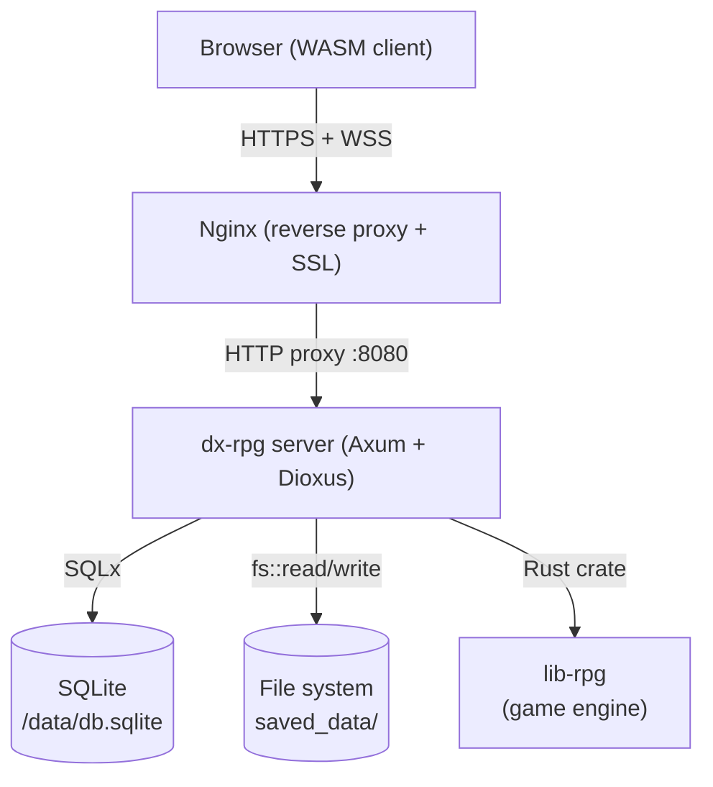
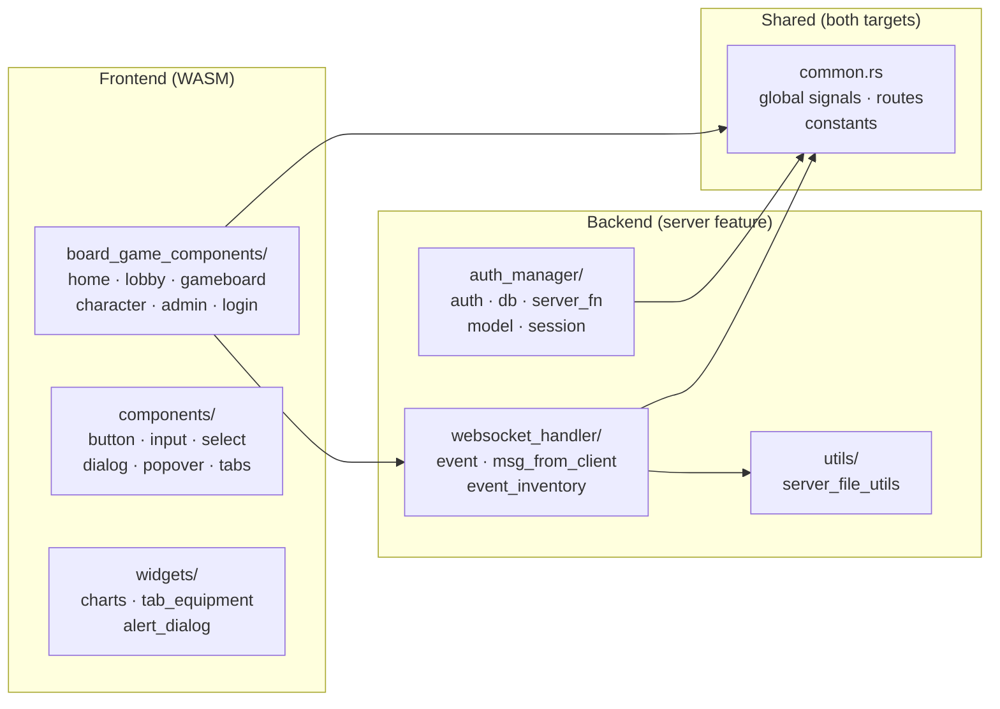
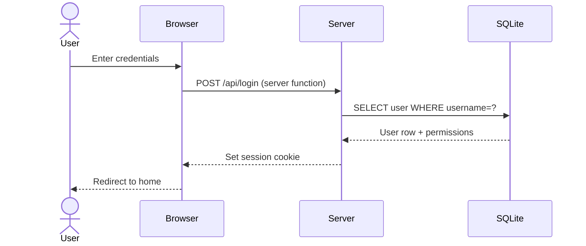
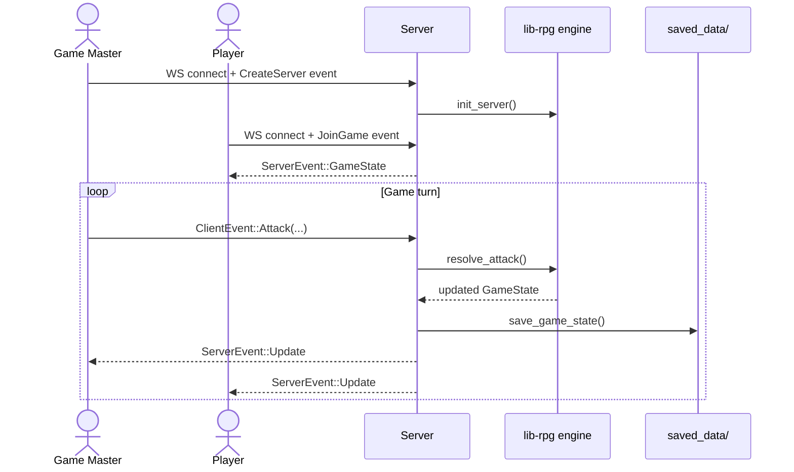
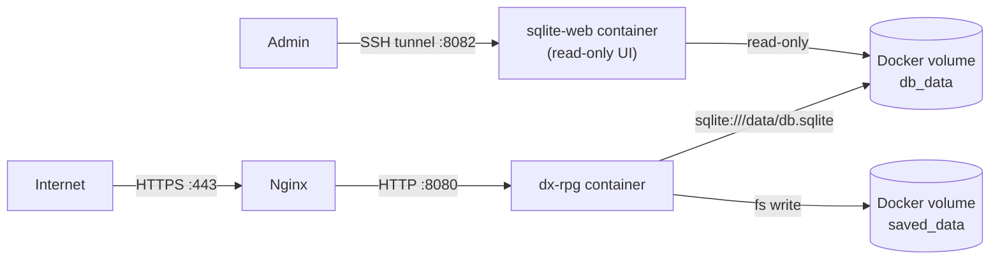

# Dx-rpg

A browser-based multiplayer RPG built with [Dioxus](https://dioxuslabs.com/) (Rust fullstack framework) using the [lib-rpg](https://github.com/r0nd0ud0u/lib-rpg) engine for game logic.

- **Frontend**: Dioxus (WebAssembly)
- **Backend**: Axum (HTTP + WebSocket server)
- **Database**: SQLite via SQLx
- **Auth**: Session-based with axum-session

---

## Table of Contents

- [Architecture](#architecture)
- [Project Structure](#project-structure)
- [Data Flow](#data-flow)
- [Development Setup](#development-setup)
- [Responsive Design](#responsive-design)
- [Deployment](#deployment)
- [Screenshots](#screenshots)

---

## Features

### Universes & Scenario Progression

The game ships with two universes, each with 10 progressive stages:

#### LOTR Universe (`offlines/scenarios/lotr/`)

| Stage | Name | Enemies |
|-------|------|---------|
| 1 | Goblin Patrol | Gobelin Eclaireur |
| 2 | Goblin Ambush | Gobelin Eclaireur + Angmar10PV |
| 3 | The Orc Pillager | Orc Pillard |
| 4 | Mixed Patrol | Orc Pillard + Gobelin Eclaireur |
| 5 | The Orc Champion | Champion Orc |
| 6 | Champion's Wrath | Champion Orc + Gobelin Eclaireur |
| 7 | Shadow of Mordor | Necromancien du Mordor |
| 8 | Ritual of Darkness | Necromancien du Mordor + Gobelin Eclaireur |
| 9 | The Faceless Rider | Nazgul |
| 10 | The Eye of Sauron | Sauron l'Oeil Flamboyant |

#### Pokémon Universe (`offlines/scenarios/pokemon/`)

| Stage | Name | Enemies |
|-------|------|---------|
| 1 | Rattata Patrol | Rattata |
| 2 | Double Strike | Rattata + Pidgey |
| 3 | Mankey's Fury | Mankey |
| 4 | Mountain Ambush | Mankey + Pidgey |
| 5 | Machoke the Colossus | Machoke |
| 6 | Gengar's Shadow | Gengar |
| 7 | Tower Ghosts | Haunter + Gengar |
| 8 | Dragonite Unleashed | Dragonite |
| 9 | Mewtwo Awakened | Mewtwo |
| 10 | Armored Mewtwo Ultimate | Mewtwo Armure |

**Pokémon Heroes** (selectable characters):

| Character | Class | Energy | Signature Moves |
|-----------|-------|--------|-----------------|
| Bulbasaur | Mage | Mana | Vine Whip, Leech Seed, Razor Leaf, Solar Beam |
| Charmander | Berserker | Berserk | Ember, Fire Spin, Flamethrower, Fire Blast |
| Squirtle | Warrior | Vigor | Water Gun, Withdraw, Surf, Ice Beam |

Each scenario is defined as a JSON file under `offlines/scenarios/`. Characters live in `offlines/characters/` and attacks in `offlines/attack/<character-name>/`.

### Save Slot System

Players are limited to a configurable number of save slots (default: 3). Configure via `.env`:

```env
MAX_SAVES=3
```

The "Create Server" page shows all save slots with:
- Empty slots: click to start a new game immediately
- Occupied slots: shows game name, current scenario, and last save date; click to select then "Overwrite & Play"

### Attack Tooltips with Description

Attacks can include two optional text fields in their JSON:

```json
{
  "Nom": "Razor Leaf",
  "Description": "Fires sharp leaves in a barrage — high damage with a short cooldown.",
  "DescriptionEffects": "Deals 60 magic damage to one enemy; 3-turn cooldown.",
  ...
}
```

When present, hovering over the attack button in the character sheet shows a tooltip with:
- `Description` — the flavour text, in italics
- `DescriptionEffects` — a structured **Effects** section summarising the mechanical effects (damage, buffs, cooldown…)

The tooltip is shown only while the **Attack Tooltips** setting is enabled (see Settings below).

> **Cooldown effects:** an attack is put on cooldown by a `CooldownTurnsNumber` effect. The number of turns the attack stays blocked is read from the effect's `Buffer.value` (and mirrored in `Value` / `Tours actifs`). These three must match — a `Buffer.value` of `0` means *no* cooldown, so the attack can be re-cast immediately.

### Scenarios Progress Sheet

During a game, click **📜 Scenarios** in the game toolbar to open a side sheet showing all scenarios and their progress state (Not Started / In Progress / ✅ Completed).

### Admin Panel

Enable the admin panel via `.env`:

```env
ADMIN_ENABLED=true
```

Navigate to `/admin` to access:
- **Users tab**: list all users with connection status and save count; delete users
- **Scenarios tab**: filter by universe, then list/add/edit/delete scenarios for that universe via an inline JSON editor
- **Characters tab**: filter by universe; list all hero characters with portrait, class, level, description, universe badge, and full stats table

### Game Mode: Single-player vs Multiplayer

When creating a server, choose between:
- **Multiplayer** (default): each connected player picks exactly one character; other characters appear as locked (🔒) on the selection screen
- **Single-player**: one player can pick multiple heroes; each extra hero is added with an `__sp{N}` key; the player controls all heroes in battle. Clicking a **selected** hero card in single-player mode deselects and removes that hero from the current game session.

The **Inventory sheet** adapts to the mode: in single-player it shows a tab per hero so you can inspect each character's stats & equipment; in multiplayer it shows only your own hero's data.

### Settings Panel (⚙️)

In the game toolbar, a **Settings** sheet lets each user toggle options that are persisted per-user in the DB:

| Setting | Key | Default | Description |
|---------|-----|---------|-------------|
| Attack Tooltips | `show_atk_tooltips` | on | Show attack description and effects on hover in the attack list |
| Boss Energy Bars | `show_boss_energy` | off | Show mana/vigor/berserk bars on boss panels |
| Hero Aggro | `show_hero_aggro` | off | Show aggro value on hero panel headers |
| Boss HP Bar | `show_boss_hp` | on | Show the HP bar on boss panels |
| Auto-save on Scenario | `auto_save_on_scenario` | on | Automatically save the game at the start of each new scenario |

Each setting is stored as an independent context in Dioxus using a distinct newtype wrapper (`CtxShowBossHp`, `CtxShowBossEnergy`, etc.) to prevent context-key collisions that would otherwise occur since all `Signal<bool>` share the same `TypeId`.

### Damage Formula & Armor

Combat damage is computed by `lib-rpg` using:

```
raw_damage  = atk_value − (launcher_power / nb_turns)
effective   = round(raw_damage × 100 / (100 + target_armor))
```

The armor constant `100` means that:
- A character with **100 armor** takes **half** of the raw hit
- Hero armor (0–90 range) gives **16–47% damage reduction** — meaningful enough that armor upgrades and debuffs visibly affect outcomes
- Boss armor is tuned in the same scale (e.g. Angmar 80, Nazgul 50) to preserve boss durability relative to hero attacks

The combat log shows the actual HP change and, when the armor cap reduces the raw hit, a `(raw: N)` reminder:
```
Last attack: Charge
Squirtle → -43 HP (raw: -75)
```

Non-HP effects display descriptive text:
```
Thraïn_#1 → 40 HP (raw: 140)
Thraïn_#1 → debuff removed
Thraïn_#1 → HP effects reset
Cooldown on Thalia_#1: 5 turns
```

`GameAtkEffect::log_text()` in lib-rpg centralises this rendering logic and returns `None` for
no-op effects (e.g. `RemoveOneDebuf` when there is no debuff to remove) so they are silently
skipped rather than showing a confusing `→ 0` line.

### Game Stats Sheet (improved)

The 📊 Stats sheet now shows:
- KPI grid: Turn, Round, Kill count (correctly accumulates across scenarios)
- Active player indicator
- Scenario progress bar (scenarios completed / total)
- Current scenario name, level, universe
- HP bars for all active heroes
- Favourite attack card spanning full width to avoid truncation

### Load Game page

The Load Game page now shows save-slot style cards identical to the Create Server page, with load and delete actions inline.

---

## Configuration (`.env`)

| Variable | Default | Description |
|----------|---------|-------------|
| `IP` | `0.0.0.0` | Bind address |
| `PORT` | `8080` | HTTP port |
| `DATABASE_URL` | `sqlite:db.sqlite` | SQLite connection string |
| `USE_PASSWORD` | `false` | Require password on login |
| `MAX_SAVES` | `3` | Max save slots per user |
| `ADMIN_ENABLED` | `false` | Enable `/admin` panel |

---

## Architecture

### High-level overview



### Module map



---

## Project Structure

```
dx-rpg/
├── src/
│   ├── main.rs                   # Entry point — client launch + server setup (Axum)
│   ├── lib.rs                    # Module declarations
│   ├── common.rs                 # Shared globals (signals, routes, constants)
│   ├── auth_manager/             # User authentication & session management (server only)
│   │   ├── db.rs                 # SQLite pool init, table creation, seed data
│   │   ├── auth.rs               # Axum auth layer
│   │   ├── server_fn.rs          # Dioxus server functions for login/logout
│   │   └── model.rs              # User model
│   ├── board_game_components/    # Page-level Dioxus components
│   │   ├── home_page.rs          # Landing / dashboard
│   │   ├── login_page.rs         # Login form
│   │   ├── lobby_page.rs         # Pre-game lobby
│   │   ├── gameboard.rs          # Main game UI
│   │   ├── character_page.rs     # Character sheet
│   │   ├── admin_page.rs         # Admin panel
│   │   └── ...
│   ├── components/               # Reusable UI primitives (button, input, select…)
│   ├── websocket_handler/        # Real-time game event bus (client ↔ server)
│   │   ├── event.rs              # ClientEvent / ServerEvent enums + handlers
│   │   ├── msg_from_client.rs    # Incoming message parsing
│   │   └── event_inventory.rs    # Per-session event queue
│   ├── utils/
│   │   └── server_file_utils.rs  # Save / load game state to/from disk
│   └── widgets/                  # Composite UI widgets (charts, equipment tab…)
├── offlines/                     # Static game data (characters, scenarios, attacks)
│   ├── characters/               # JSON character definitions — organized by universe
│   │   ├── lotr/                 # LOTR hero & boss characters
│   │   └── pokemon/              # Pokémon hero & boss characters
│   ├── scenarios/                # JSON scenario definitions — organized by universe
│   │   ├── lotr/                 # LOTR stages (stage_1.json … stage_10.json)
│   │   └── pokemon/              # Pokémon stages (stage_1.json … stage_10.json)
│   └── attack/                   # JSON attack/skill definitions
├── assets/                       # CSS and static assets
├── docs/                         # Deployment documentation
├── scripts/                      # Build & Docker helper scripts
├── Dockerfile                    # Multi-stage Docker build
├── deploy/                       # Docker Compose stack & Nginx configs
│   └── docker-compose.yml        # Production stack (app + SQLite web UI)
└── Cargo.toml
```

---

## Data Flow

### Authentication flow



### Game session flow (WebSocket)



### Docker / production deployment flow



---

## Development Setup

### Prerequisites

- Rust stable toolchain
- Dioxus CLI (`cargo binstall dioxus-cli@0.7.9 --force`)
- SSH access to the lib-rpg private dependency (add to `~/.cargo/config.toml`):

```toml
[net]
git-fetch-with-cli = true

[target.wasm32-unknown-unknown]
rustflags = ['--cfg', 'getrandom_backend="wasm_js"']
```

### Run locally

```bash
dx serve --platform web
# Open http://localhost:8080
```

---

## Responsive Design

The UI is designed to work on desktop, tablet, and mobile devices.
All responsive rules live in `assets/main.css` as two `max-width` media-query layers
stacked on top of the existing desktop-first styles.

### Strategy

| Breakpoint | Target | Key changes |
|------------|--------|-------------|
| ≥ 769 px (default) | Desktop | Full 3-column game board, fixed navbar, all sidebars visible |
| ≤ 768 px | Tablet / landscape phone | Game board collapses to single column (heroes → log → bosses stacked), reduced padding & font sizes, toolbar wraps, username badge hidden |
| ≤ 480 px | Portrait phone | Action grid forces 2 columns, save-slot cards go 1-column, mode-toggle and action buttons stack vertically, character portrait shrinks to 56 px |

### What is already responsive (no media queries needed)

- Most card grids use `auto-fill` / `auto-fit` and reflow naturally.
- Admin tables scroll horizontally via `overflow-x: auto` on their container.
- The footer and lobby info bar use `flex-wrap: wrap`.
- The viewport meta tag (`width=device-width, initial-scale=1`) is present in `index.html`.

### Touch-friendliness notes

- All interactive buttons are `≥ 44 px` tall in their default (desktop) state.
- Attack target buttons use absolute positioning and remain tappable as circular hit-areas.
- Sheet overlays (Dioxus `Sheet` component) occupy the full screen width on narrow viewports.

---

## Deployment

### With Docker Compose (recommended for production)

```bash
# Pull and start (app + SQLite web UI)
./scripts/docker_compose_up.sh

# Stop (data volumes are preserved)
./scripts/docker_compose_down.sh

# Full reset including data
docker compose down -v
```

**Persistent data** is stored in named Docker volumes:

| Volume | Path in container | Content |
|--------|-------------------|---------|
| `dx-rpg_db_data` | `/data/db.sqlite` | User accounts, sessions |
| `dx-rpg_saved_data` | `/usr/local/app/saved_data/` | Per-user game saves |
| `dx-rpg_photos_data` | `/usr/local/app/photos/` | Admin-uploaded images |

All volumes survive `docker compose stop`, `docker compose down`, and image updates. Only `docker compose down -v` removes them.

> **Note**: `docker_compose_up.sh` and `docker_compose_down.sh` both use `--remove-orphans` to automatically clean up containers from previous service definitions.

### SQLite web UI (admin)

The `sqlite-web` service runs on port **8082**, bound to loopback only.  
Access it remotely via SSH tunnel:

```bash
ssh -L 8082:localhost:8082 user@your-server
# Then open http://localhost:8082 in your browser
```

### Build locally and push

```bash
# Build image locally (--no-cache forces a fresh build; prunes dangling images on completion)
./scripts/docker_build.sh

# Or trigger the GitHub Action by pushing a tag
git tag v1.2.3 && git push origin v1.2.3
```

> `docker_build.sh` always passes `--no-cache` to avoid stale cached layers when dependencies or
> `offlines/` data change between builds. Old dangling images are pruned automatically after each build.

---

## Screenshots

### Home page — before login


### Home page — after login


### Create server page


### New game page


### Load game page


### Join game page


