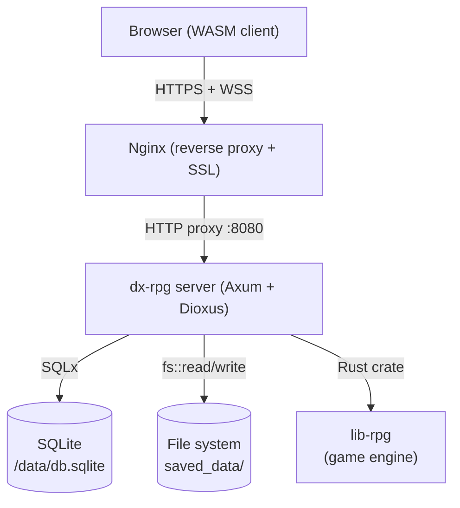
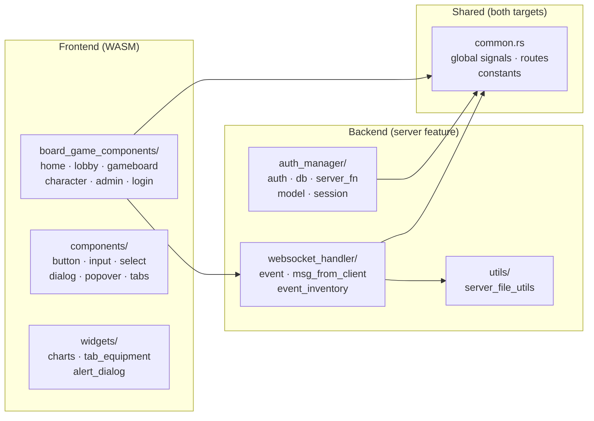
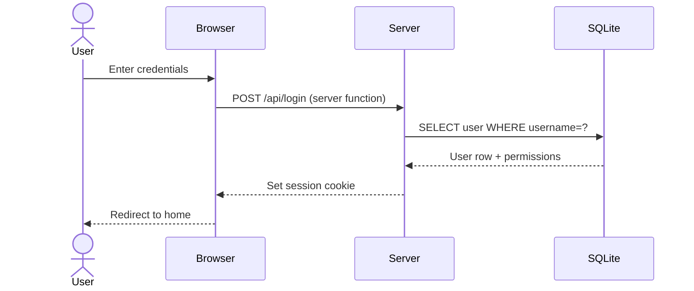
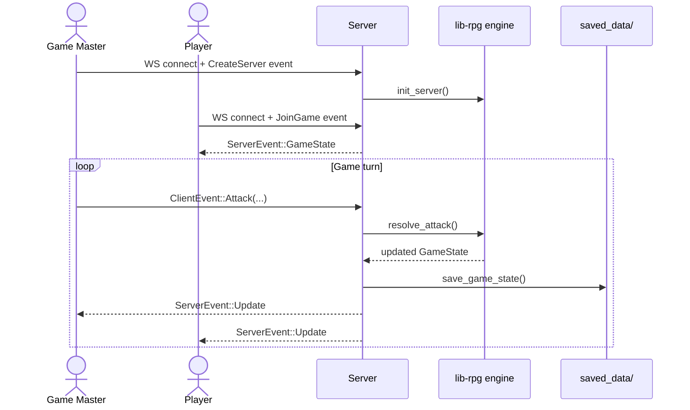
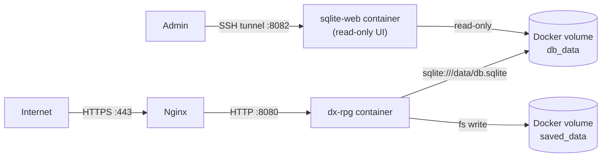

# Dx-rpg

A browser-based multiplayer RPG built with [Dioxus](https://dioxuslabs.com/) (Rust fullstack framework) using the [lib-rpg](https://github.com/r0nd0ud0u/lib-rpg) engine for game logic.

- **Frontend**: Dioxus (WebAssembly)
- **Backend**: Axum (HTTP + WebSocket server)
- **Database**: SQLite via SQLx
- **Auth**: Session-based with axum-session

---

## Table of Contents

- [Architecture](#architecture)
- [Project Structure](#project-structure)
- [Data Flow](#data-flow)
- [Development Setup](#development-setup)
- [Deployment](#deployment)
- [Screenshots](#screenshots)

---

## Features

### 10-Stage Scenario Progression

The game ships with 10 progressive stages designed to level up players gradually:

| Stage | Name | Enemy | Recommended Level |
|-------|------|-------|-------------------|
| 1 | Patrouille Gobeline | Gobelin Eclaireur | 1 |
| 2 | Embuscade Gobeline | Gobelin Eclaireur + Angmar10PV | 2 |
| 3 | Le Pillard Orc | Orc Pillard | 3 |
| 4 | Patrouille Mixte | Orc Pillard + Gobelin Eclaireur | 4 |
| 5 | Le Champion des Orcs | Champion Orc | 5 |
| 6 | Colère du Champion | Champion Orc + Gobelin Eclaireur | 6 |
| 7 | L'Ombre du Mordor | Nécromancien du Mordor | 7 |
| 8 | Rituel des Ténèbres | Nécromancien + Gobelin Eclaireur | 8 |
| 9 | Le Cavalier Sans Visage | Nazgul | 9 |
| 10 | L'Oeil de Sauron | Sauron l'Oeil Flamboyant (Boss) | 10 |

Each scenario is defined as a JSON file under `offlines/scenarios/`. Enemies are defined in `offlines/characters/` and their attacks in `offlines/attack/<enemy-name>/`.

### Save Slot System

Players are limited to a configurable number of save slots (default: 3). Configure via `.env`:

```env
MAX_SAVES=3
```

The "Create Server" page shows all save slots with:
- Empty slots: click to start a new game immediately
- Occupied slots: shows game name, current scenario, and last save date; click to select then "Overwrite & Play"

### Attack Tooltips with Description

Attacks can now include an optional `Description` field in their JSON:

```json
{
  "Name": "Griffure",
  "Description": "A quick scratch dealing light physical damage.",
  ...
}
```

When present, hovering over the attack button in the character sheet shows the description as a tooltip.

This requires `lib-rpg` branch `feat/attack-description` (commit `08af5ad82d406aee8f452f05e7b763035fa2fd44`).

### Scenarios Progress Sheet

During a game, click **📜 Scenarios** in the game toolbar to open a side sheet showing all scenarios and their progress state (Not Started / In Progress / ✅ Completed).

### Admin Panel

Enable the admin panel via `.env`:

```env
ADMIN_ENABLED=true
```

Navigate to `/admin` to access:
- **Users tab**: list all users with connection status and save count; delete users
- **Scenarios tab**: list all loaded scenarios with level, boss count, and description

---

## Configuration (`.env`)

| Variable | Default | Description |
|----------|---------|-------------|
| `IP` | `0.0.0.0` | Bind address |
| `PORT` | `8080` | HTTP port |
| `DATABASE_URL` | `sqlite:db.sqlite` | SQLite connection string |
| `USE_PASSWORD` | `false` | Require password on login |
| `MAX_SAVES` | `3` | Max save slots per user |
| `ADMIN_ENABLED` | `false` | Enable `/admin` panel |

---

## Architecture

### High-level overview



### Module map



---

## Project Structure

```
dx-rpg/
├── src/
│   ├── main.rs                   # Entry point — client launch + server setup (Axum)
│   ├── lib.rs                    # Module declarations
│   ├── common.rs                 # Shared globals (signals, routes, constants)
│   ├── auth_manager/             # User authentication & session management (server only)
│   │   ├── db.rs                 # SQLite pool init, table creation, seed data
│   │   ├── auth.rs               # Axum auth layer
│   │   ├── server_fn.rs          # Dioxus server functions for login/logout
│   │   └── model.rs              # User model
│   ├── board_game_components/    # Page-level Dioxus components
│   │   ├── home_page.rs          # Landing / dashboard
│   │   ├── login_page.rs         # Login form
│   │   ├── lobby_page.rs         # Pre-game lobby
│   │   ├── gameboard.rs          # Main game UI
│   │   ├── character_page.rs     # Character sheet
│   │   ├── admin_page.rs         # Admin panel
│   │   └── ...
│   ├── components/               # Reusable UI primitives (button, input, select…)
│   ├── websocket_handler/        # Real-time game event bus (client ↔ server)
│   │   ├── event.rs              # ClientEvent / ServerEvent enums + handlers
│   │   ├── msg_from_client.rs    # Incoming message parsing
│   │   └── event_inventory.rs    # Per-session event queue
│   ├── utils/
│   │   └── server_file_utils.rs  # Save / load game state to/from disk
│   └── widgets/                  # Composite UI widgets (charts, equipment tab…)
├── offlines/                     # Static game data (characters, scenarios, attacks)
│   ├── characters/               # JSON character definitions
│   ├── scenarios/                # JSON scenario definitions
│   └── attack/                   # JSON attack/skill definitions
├── assets/                       # CSS and static assets
├── docs/                         # Deployment documentation
├── scripts/                      # Build & Docker helper scripts
├── Dockerfile                    # Multi-stage Docker build
├── docker-compose.yml            # Production stack (app + SQLite web UI)
└── Cargo.toml
```

---

## Data Flow

### Authentication flow



### Game session flow (WebSocket)



### Docker / production deployment flow



---

## Development Setup

### Prerequisites

- Rust stable toolchain
- Dioxus CLI (`cargo binstall dioxus-cli@0.7.9 --force`)
- SSH access to the lib-rpg private dependency (add to `~/.cargo/config.toml`):

```toml
[net]
git-fetch-with-cli = true

[target.wasm32-unknown-unknown]
rustflags = ['--cfg', 'getrandom_backend="wasm_js"']
```

### Run locally

```bash
dx serve --platform web
# Open http://localhost:8080
```

---

## Deployment

### With Docker Compose (recommended for production)

```bash
# Pull and start (app + SQLite web UI)
./scripts/docker_compose_up.sh

# Stop (data volumes are preserved)
./scripts/docker_compose_down.sh

# Full reset including data
docker compose down -v
```

**Persistent data** is stored in two named Docker volumes:

| Volume | Path in container | Content |
|--------|-------------------|---------|
| `dx-rpg_db_data` | `/data/db.sqlite` | User accounts, sessions |
| `dx-rpg_saved_data` | `/usr/local/app/saved_data/` | Per-user game saves |

Both volumes survive `docker compose stop`, `docker compose down`, and image updates. Only `docker compose down -v` removes them.

### SQLite web UI (admin)

The `sqlite-web` service runs on port **8082**, bound to loopback only.  
Access it remotely via SSH tunnel:

```bash
ssh -L 8082:localhost:8082 user@your-server
# Then open http://localhost:8082 in your browser
```

### Build locally and push

```bash
# Build image locally
./scripts/docker_build.sh

# Or trigger the GitHub Action by pushing a tag
git tag v1.2.3 && git push origin v1.2.3
```

---

## Screenshots

### Home page — before login


### Home page — after login


### Create server page


### New game page


### Load game page


### Join game page


